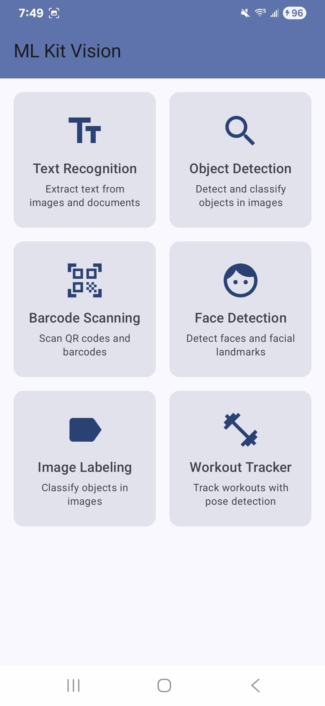
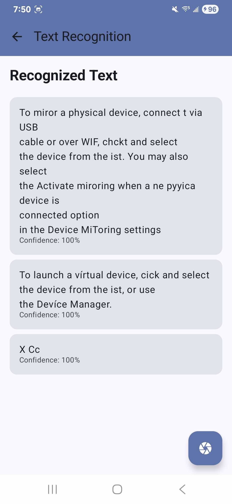
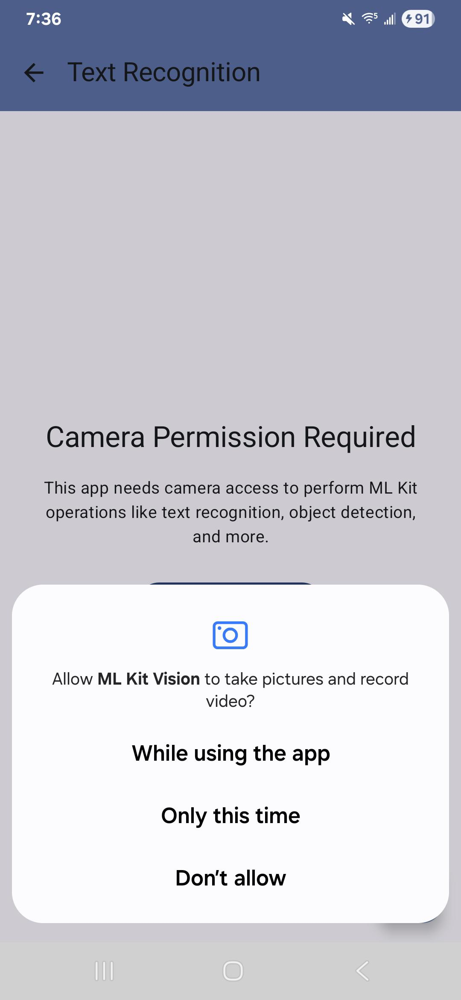
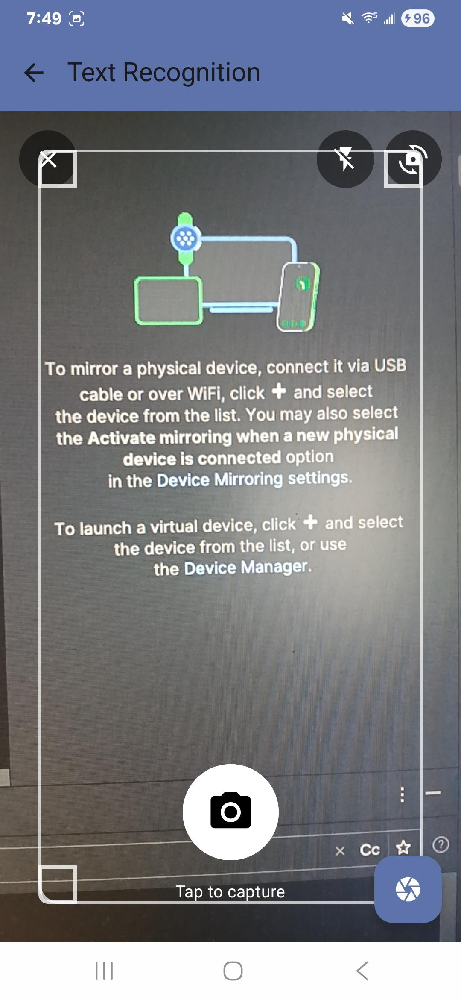

# ML Kit Vision Android App

A comprehensive Android application demonstrating Google ML Kit's computer vision capabilities with a modern, professional camera interface.

## 🚀 Features

### **Core ML Kit Capabilities**
- **Text Recognition** - Extract text from images and documents
- **Object Detection** - Detect and classify objects in images  
- **Barcode Scanning** - Scan QR codes and barcodes
- **Face Detection** - Detect faces and facial landmarks
- **Image Labeling** - Classify objects in images
- **Workout Tracker** - Track workouts with pose detection

### **Enhanced Camera Component**
- **Professional UI Design** - Modern camera app interface
- **Capture Button** - Prominent white circular button with loading states
- **Camera Controls** - Flash toggle, front/back camera switch
- **Visual Guides** - Corner markers and framing overlays
- **Capture Animation** - Smooth feedback during photo capture
- **Permission Handling** - Integrated camera permission management

## 📱 Screenshots

### Home Screen

*Main ML Kit Vision home screen with 6 feature cards*

### Camera Interface

*Text Recognition screen with fully functional camera component*

### Permission System

*System camera permission request dialog*

### ML Kit Results

*Successfully processed text recognition with 100% confidence*

## 🛠️ Technical Stack

- **Language**: Kotlin
- **UI Framework**: Jetpack Compose
- **Architecture**: MVVM with Clean Architecture
- **Dependency Injection**: Hilt
- **ML Kit**: Google ML Kit Vision APIs
- **Camera**: CameraX
- **Navigation**: Compose Navigation
- **State Management**: StateFlow

## 🔧 Setup & Installation

### Prerequisites
- Android Studio Arctic Fox or later
- Android SDK 24+ (API level 24)
- Kotlin 1.9.22
- Compose Compiler 1.5.10

### Dependencies
```kotlin
// ML Kit
implementation("com.google.mlkit:text-recognition:16.0.0")
implementation("com.google.mlkit:object-detection:17.0.0")
implementation("com.google.mlkit:barcode-scanning:17.2.0")
implementation("com.google.mlkit:face-detection:16.1.5")
implementation("com.google.mlkit:image-labeling:17.0.7")

// CameraX
implementation("androidx.camera:camera-core:1.4.0-alpha04")
implementation("androidx.camera:camera-camera2:1.4.0-alpha04")
implementation("androidx.camera:camera-lifecycle:1.4.0-alpha04")
implementation("androidx.camera:camera-view:1.4.0-alpha04")
```

## 🎯 Current Status

### ✅ **Working Features**
- **Camera Component**: Fully functional with professional UI
- **Text Recognition**: Complete pipeline from capture to results
- **Permission System**: Proper camera permission handling
- **Navigation**: Smooth navigation between all screens
- **UI/UX**: Modern Material 3 design

### 🔄 **In Development**
- **Object Detection**: Camera working, ML Kit processing needs debugging
- **Barcode Scanning**: Camera working, ML Kit processing needs debugging  
- **Face Detection**: Camera working, ML Kit processing needs debugging
- **Image Labeling**: Camera working, ML Kit processing needs debugging
- **Workout Tracker**: Camera working, ML Kit processing needs debugging

## 🐛 Known Issues & Debugging

### **ML Kit Processing Issue**
Most ML Kit features show camera interface but don't display results. This appears to be a processing pipeline issue rather than a camera problem.

### **Debug Features Added**
- Comprehensive logging throughout ML Kit pipeline
- Debug controls in BarcodeScanningScreen
- State update testing
- ML Kit library initialization testing

### **Debug Steps**
1. Navigate to Barcode Scanning Screen
2. Use debug controls to test different functionality
3. Check Android Studio Logcat for detailed error information
4. Look for patterns in ML Kit processing failures

## 🚀 Getting Started

1. **Clone the repository**
   ```bash
   git clone https://github.com/sanjaynela/MlKitAndroid.git
   ```

2. **Open in Android Studio**
   - Open the project in Android Studio
   - Sync Gradle files
   - Build the project

3. **Run on device/emulator**
   - Ensure device has camera
   - Grant camera permissions when prompted
   - Test different ML Kit features

## 📁 Project Structure

```
app/src/main/java/com/example/mlkitandoird/
├── data/
│   ├── model/MLKitResult.kt          # ML Kit result data classes
│   └── repository/MLKitRepository.kt # ML Kit processing logic
├── di/
│   └── AppModule.kt                  # Hilt dependency injection
├── ui/
│   ├── components/
│   │   ├── CameraComponent.kt        # Enhanced camera interface
│   │   └── PermissionComponent.kt    # Permission handling
│   ├── screens/                      # All ML Kit feature screens
│   ├── theme/                        # Material 3 theming
│   └── viewmodel/MLKitViewModel.kt   # State management
└── MLKitApplication.kt               # Hilt application class
```

## 🤝 Contributing

This project demonstrates modern Android development practices with ML Kit integration. Feel free to:

- Report issues with ML Kit processing
- Suggest UI/UX improvements
- Contribute to debugging efforts
- Add new ML Kit features

## 📄 License

This project is for educational and demonstration purposes.

## 🔗 Links

- **Repository**: [https://github.com/sanjaynela/MlKitAndroid](https://github.com/sanjaynela/MlKitAndroid)
- **ML Kit Documentation**: [https://developers.google.com/ml-kit](https://developers.google.com/ml-kit)
- **Jetpack Compose**: [https://developer.android.com/jetpack/compose](https://developer.android.com/jetpack/compose)

---

**Note**: The camera component is fully functional and provides a professional user experience. The main focus is on debugging the ML Kit processing pipeline to get all features working end-to-end.
